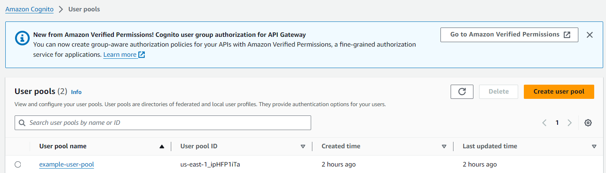
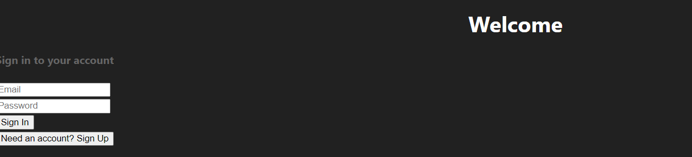
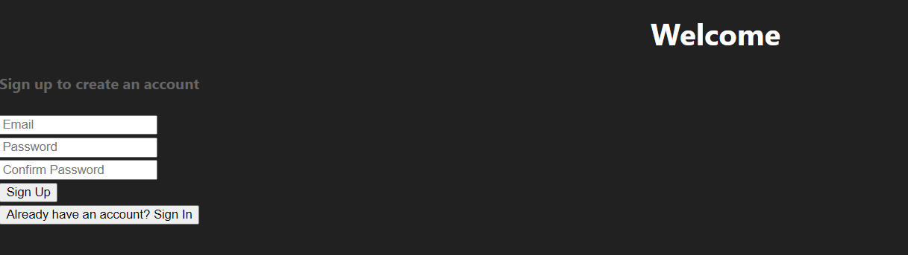
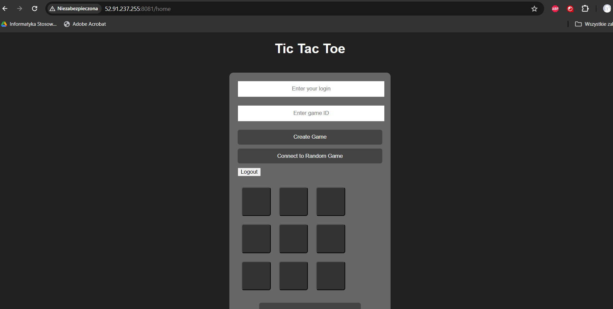

# Wiktor Tomczyk - Cognito report

- Course: *Cloud programming*
- Group: W04IST-SI0828G
- Date: 26.05.2024

# Environment architecture

## Virtual Private Cloud (VPC):
  * Created a VPC in AWS, functioning as an isolated private network for the infrastructure.
## EC2 Instance:
  * Using Terraform, provisioned an EC2 instance in the VPC's public subnet.
  * On the EC2 instance, Docker environment was deployed, hosting containers with the game.
## Docker Containers:
  * Docker containers running on the EC2 instance hosted the game.
  * Docker containers were run by Docker Compose
## Security Groups:
  * Configured security groups in order to allow to open the address in internet browser
## AWS Cognito
 * User Pool - the user pool stores and manages user information. It is configured to verify users via email and enforce a strong password policy.
## User Pool Client - the user pool client allows the application to interact with the user pool, enabling features like user login, signup, and authentication token retrieval.

# Preview

Screenshots of configured AWS services. Screenshots of your application running.

# Reflections

# Reflections

During this project, I learned how to configure AWS Cognito for secure user authentication and management. This included:

- Setting up a Cognito User Pool to store and manage user data.
- Configuring email verification and password policies within the user pool.
- Creating a User Pool Client to enable application interaction with the user pool.
- Integrating AWS Cognito with both the frontend and backend of the application for seamless authentication.
  
I overcame several obstacles during the project, including:

- Creating user pool in Cognito
- Creating user pool client in Cognito
- Configuring Spring Security with Cognito in order to authenticate users, configuring CORS, and sending tokens to backend
- Using Cognito authentication in frontend part of the app
  
To overcome these obstacles, I found the following resources most helpful:

- StackOverflow
- youtube tutorials
- AWS tutorial which shows how to integrate cognito with frontend
- other internet forums
